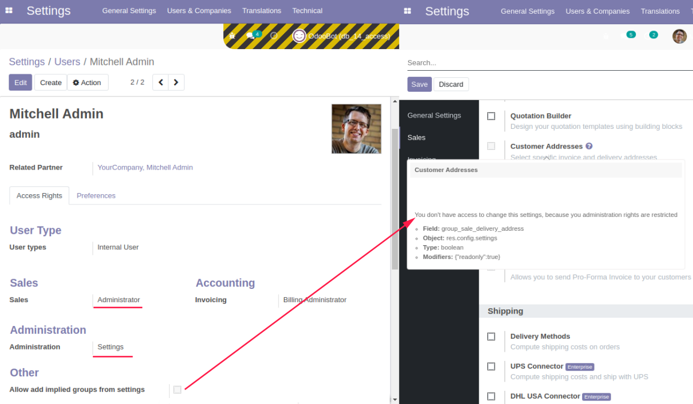

==================================
 Restricted administration rights
==================================

Installation
============

* `Install <https://odoo-development.readthedocs.io/en/latest/odoo/usage/install-module.html>`__ this module in a usual way.

Configuration
=============

**IMPORTANT NOTE:**  After installing the module, only superuser can see all the groups without limitations. 

This module allows certain users to configure modules from ``[[ Settings ]]`` 
menu using boolean fields which ``Field`` value starts with a **group_** 
`(This info is displayed when hovering over the option name if developer tools is enabled)`

The only users who are in special group **'Allow add implied groups from settings'** 
have access to make changes in forbidden for others fields. 

There is only one configuration option this module provides:
 
- Under superuser open  ``[[ Settings  ]] >> Users & Companies >> Users``  and select user's profile 
- In ``Access Rights`` tab activate 'Allow add implied groups from settings'

The user is then allowed to add additional access groups for himself 
by using the Boolean settings fields. `(res.config.settings models views)`
  
Usage
=====
Let's take an example of using this module and **Sales** module (sale_management).

**Without this module installed:**

Say you have a user with administration rights ``Administration: Access Rights``.
This user thus may increase his own rights in ``Access Rights > Sales`` 
from ``Sales: User: Own Documents Only`` to ``Sales: Administrator``.

Also he can open menu ``[[ Sales ]] >> Configuration >> Settings`` and 
select Customer Addresses (**group_** sale_delivery_address) there and then click ``[Apply]`` button 

**With this module installed:** 

The example user cannot increase their privileges.
There is no ``Sales: Administrator`` option for it and for this reason 
there are no module settings, including the 
``Client Addresses`` option.

============

To activate the ``Customer Addresses`` option, the user must be:  

- with administration rights ``Administration: Settings`` and also with ``Sales: Administrator`` rights

- is included in the **'Allow add implied groups from settings'** group.

The screenshot shows a user who is not included to 'Allow add implied groups from settings' group 
and therefore cannot activate the ``Customer Addresses`` option.

